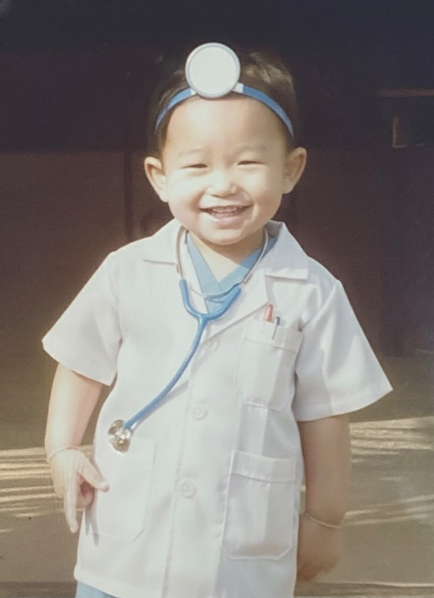

# Member 1 : ชนาทิป ยิ่งยง

- Nickname : อันดา
- Age :19 ปี

---

## Why did you choose to study at SIT, KMUTT?

- อันดาอยากทำบริษัทเกมเป็นของตัวเองเพื่อน อยากทำบริษัทให้มีคนรู้จักทั่วโลก เลยเลือกเรียนคณะนี้ค้าบ

## How do you feel now that you are actually studying at SIT, KMUTT?

- อันดารู้สึกว่าเนื้อหาเรียนอะง่ายนะ แต่อันดาอะหลุดค่อนข้างง่าย แบบไม่ค่อยโฟกัส สไลด์เป็นภาษาอังกฤษ ถ้าไม่ฟังอาจาร์ยก็หลุด แต่ก็เรียนรู้เรื่องสนุกๆเลย ความสัมพันธ์กับเพื่อนๆก็ดีนะ สนุกเลยละ เอาไป10/10

## What was your first impression of SIT, KMUTT?

- ชอบคณิตกับbusiness เพื่อน รู้สึกสนุกดี เพราะเป็นคนชอบคิดจินตนาการอยู่แล้วบวกกับbusinesss ที่เอาไปต่อยอดกับธุรกิจในอนาคตได้เลยชอบมากๆเลยเพื่อน

## What are your hobbies?

- อันดาชอบทำคลิปเล่นๆเพื่อน เอาไว้ฝึกพูดฝึกตัดต่อ อัพsoft skill ดูยูทูป แล้วก็ฟังpodcast
## What are you interested in?

- การสร้างai อันดาอยากสร้าง Ai ที่เหมือนกับจาวิสเป็นพิเศษ แล้วก็การสร้างเกมกำลังศึกษา ทำโปรเจคไว้ เผื่อได้นำไปใส่ใน resume

## Contact

- [Instagram](https://www.instagram.com/dalo_te/)
- [GitHub](https://github.com/DALOTE888)

---

### Introduction written by 
- รพีภัทร ก้อนแก้ว(ไอซ์)

---
[Back To Our Team](../our-team.md)
