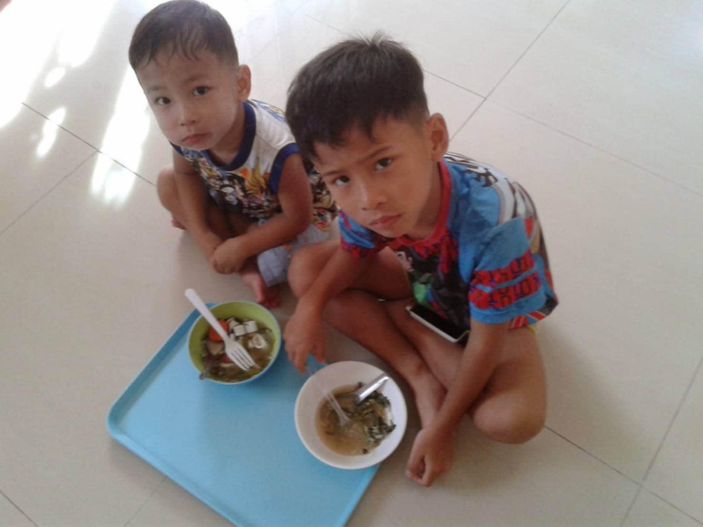

# Member 6 : รพีภัทร ก้อนแก้ว

- Nickname : ไอซ์์
- Age : 19

---

## Why did you choose to study at SIT, KMUTT?

- ด้วยความที่เราเรียนห้องวิทย์-คอมตอนม.ปลายมา พอมหาลัยเราก็เลยคิดจะต่อในสายนี้ไปเลยดีกว่า เพราะคิดว่าสายนี้สามารถไปต่อไปหลายสายอาชีพ

## How do you feel now that you are actually studying at SIT, KMUTT?

- รู้สึกว่ามันมีความท้าทายในแต่ละรายวิชา ด้วยความที่สไลด์ทุกวิชาล้วนเป็นภาษาอังกฤษทำให้เข้าใจยากหน่อย แต่พอเรียนๆไปก็สนุกดีแถมได้ซึมซับภาษาอังกฤษไปในตัว

## What was your first impression of SIT, KMUTT?

- ตอนม.4เคยมาOpen house คณะIT รู้สึกว่าบรรยากาศภายในม.ค่อนข้างโอเคและก็รุ่นพี่หลายๆคนFriendlyมาก เลยคิดว่าที่นี่มันใช่สำหรับเรา

## What are your hobbies?

- เวลาว่างๆส่วนใหญ่เราจะนัดเพื่อนๆไปเตะฟุตบอลและก็นัดกันเล่นเกม

## What are you interested in?

- เรากำลังสนใจสายงานด้านCyber Securityอยู่ เราคิดว่าสายงานนี้คนค่อนข้างขาดแคลนเพราะตอนนี้คนส่วนใหญ่สนใจด้านAiซะมากกว่า

## Contact

- [Instagram](https://www.instagram.com/icerapheekub_)
- [GitHub](https://github.com/rapheephatkk)

---

### Introduction written by
- พิชญาภา ดีประเสริฐ (เหนือ)
---